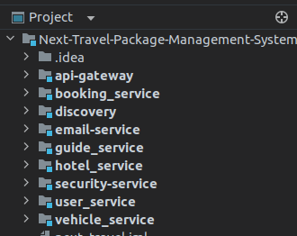

# Next Travel Pvt Ltd - Travel Planning System

## Overview

The Next Travel Pvt Ltd system is a comprehensive travel planning application developed using Spring Boot 3, Spring Cloud, and microservices architecture. It provides an intuitive platform for users to plan their travel experiences, managing various aspects like travel packages, vehicles, hotels, user authentication, and communication.

## Features

- **User Roles:**
    - Guest Users: Explore available packages, vehicles, and hotels.
    - Registered Users: Book packages, manage bookings within 48 hours, update profiles.
    - Admin Users: Manage packages, vehicles, hotels, and bookings.

- **Service Components:**
    - Travel Packages Service
    - Vehicle Service
    - Guide Service
    - Hotel Service
    - User Service
    - Email Service
    - API Gateway
    - Eureka Service Registry
    - Security Service




- **Functionality Highlights:**
    - Validation on client and server-side.
    - Payment slip upload, ID card upload, and email notifications.
    - Dynamic loading of hotels and vehicles based on user preferences.
    - Sorting vehicles based on criteria (passengers, transmission type, fuel type).
    - Different hotel charge options based on board type and room occupancy.
    - Secure user authentication and encrypted password storage. Password are encrypted using BCrypt.
    - Microservice architecture using Spring Cloud and Eureka for service discovery.

## Architecture and Design Patterns

### Microservices Architecture

The system follows a microservices architecture to provide scalability, flexibility, and modularity. Each service (Travel Packages, Vehicles, Hotels, etc.) operates independently and communicates via APIs. This architecture allows for easier development, deployment, and maintenance of individual services.

### Service Discovery with Eureka

Eureka, a service registry and discovery tool from Spring Cloud, is utilized for service registration and discovery within the microservices architecture. It allows services to find and communicate with each other dynamically.


### Design Patterns

#### Repository Pattern

The system uses the Repository pattern to manage data access logic in a separate layer, providing a clean separation between the data access code and business logic.

#### Builder Pattern

For creating complex objects like package details, the Builder pattern is implemented to simplify the creation process, enhance readability, and provide flexibility in object creation.

### n-tier Architecture: DAO and Service Layers

The Next Travel Pvt Ltd system follows an n-tier architecture, organizing its components into distinct layers for efficient management and separation of concerns. Two key layers include the Data Access Object (DAO) layer and the Service layer.

#### DAO (Data Access Object) Layer

The DAO layer serves as an interface between the application logic and the database, encapsulating all interactions with the underlying data storage. Key aspects of the DAO layer include:

- **Data Access:** DAO classes are responsible for accessing and manipulating data in the database. They encapsulate CRUD (Create, Read, Update, Delete) operations specific to each entity.
- **Entity Mapping:** Mapping of database entities to corresponding Java objects/entities is handled within the DAO layer, maintaining a clear separation of concerns.
- **Data Persistence:** DAOs manage the persistence of data, ensuring data integrity and handling transactions where necessary.

#### Service Layer

The Service layer acts as an intermediary between the DAO layer and the presentation layer (controllers or endpoints). It encapsulates business logic, coordinating various operations and interactions within the application. Key aspects of the Service layer include:

- **Business Logic:** Service classes contain the application's business logic, orchestrating the processing of data and implementing business rules.
- **Transaction Management:** Services manage transactions across multiple DAO operations, ensuring consistency and atomicity of operations.
- **Encapsulation of Operations:** Services expose methods that perform specific operations or workflows, providing a higher level of abstraction to the presentation layer.

The n-tier architecture with distinct DAO and Service layers ensures a clear separation of concerns, promotes modularity, and facilitates easier maintenance and scalability of the Next Travel Pvt Ltd system.


### Design Patterns in DAO and Service Layers

#### Facade Pattern in DAO Layer

The DAO layer in the Next Travel Pvt Ltd system implements the Facade design pattern. This pattern serves as a simplified interface to a more complex set of components within the data access layer, providing a unified interface to the outside world. Key aspects of the Facade pattern include:

- **Simplified Interface:** The Facade class provides a simplified and unified interface, hiding the complexities of multiple DAOs and their interactions.
- **Encapsulation of Logic:** It encapsulates complex data access logic and interactions with multiple entities or data sources, providing a higher-level abstraction.

#### Factory Design Pattern in DAO and Service Layers

The DAO and Service layers leverage the Factory design pattern to create instances of objects or components based on specific conditions or requirements.

##### DAO Layer's Factory Pattern

- **DAO Factory:** The DAO Factory pattern encapsulates the creation of DAO instances for different entities, abstracting the instantiation process and providing a centralized point for creating DAO instances.
- **Dynamic DAO Creation:** It allows the system to dynamically create appropriate DAO instances based on the type of entity or data source, enhancing flexibility and maintainability.

##### Service Layer's Factory Pattern

- **Service Factory:** Similarly, the Service Factory pattern encapsulates the creation of service instances, allowing the system to create service instances based on specific conditions or configurations.
- **Abstracting Service Creation:** It abstracts the creation logic, enabling the system to instantiate services based on specific criteria or dynamic requirements.

The use of the Facade pattern in the DAO layer and the Factory design pattern in both the DAO and Service layers contributes to the system's modularity, flexibility, and maintainability by encapsulating complexities and abstracting object creation processes.


## Tech Stack

### Backend
- Spring Boot 3
- Spring Data, Spring Web MVC, Spring Web Flux, Spring Validation
- Spring Security, Lombok, Model Mapper, Jackson
- MySQL, MongoDB

### Additional Services
- Spring Cloud for microservices architecture
- Eureka for service registry and discovery
- Email Service for user communication

### Security with Spring Security

The Next Travel Pvt Ltd system employs Spring Security as a core component to ensure robust security measures across the application. Spring Security, a powerful and highly customizable authentication and authorization framework, provides essential security features to safeguard the system.

#### Key Features and Implementation

- **Authentication:** Spring Security manages user authentication, verifying user identities through various mechanisms such as form-based login, OAuth, JWT, or other authentication protocols.
- **Authorization:** With Spring Security, fine-grained access control and authorization policies are established, allowing or restricting access to specific resources based on user roles and permissions.
- **Encryption and Protection:** Utilizing Spring Security features, sensitive data, including passwords and user information, is encrypted and secured against vulnerabilities.
- **Securing Endpoints:** Spring Security configurations are applied to secure application endpoints, ensuring only authorized users access protected resources.
- **Protection against Common Attacks:** Implements measures to mitigate common security threats like CSRF, XSS, SQL injection, and other vulnerabilities.

#### Implementation Details

- **Configuration:** Customized security configurations are set up using Spring Security's configuration options and annotations to define authentication and authorization rules.
- **Integration with Spring Boot:** Seamlessly integrated with Spring Boot, allowing for easy setup and efficient security implementations.

Spring Security plays a pivotal role in fortifying the Next Travel Pvt Ltd system, ensuring robust protection of user data, secure access control, and prevention of unauthorized access to sensitive resources.

### System Architecture with API Gateway

The Next Travel Pvt Ltd system employs an API Gateway service as a central point of entry for managing and routing incoming requests across various microservices. The API Gateway, a key component in the system's architecture, serves multiple purposes:

- **Request Routing:** All external client requests, whether for travel packages, vehicle details, hotels, or user services, are routed through the API Gateway.
- **Aggregation:** It aggregates and orchestrates data from multiple microservices, presenting a unified API to the clients, simplifying client interactions.
- **Security:** It handles authentication and authorization, enforcing security protocols and access control policies before requests reach the microservices.
- **Load Balancing:** Distributes incoming requests across multiple instances of microservices, ensuring optimal performance and scalability.

The API Gateway service serves as a crucial layer ensuring efficient communication between clients and the underlying microservices, enhancing security, performance, and maintainability of the entire system.

- Spring Cloud Gateway
- Integration with Eureka for service discovery
- Security measures like OAuth or JWT for authentication and authorization
- Load balancing strategies for distributing traffic among microservices

### Reactive Programming with Spring Web Flux

In addition to Spring Boot 3 and Spring Data JPA, the Next Travel Pvt Ltd system utilizes Spring Web Flux, a reactive programming framework, to handle asynchronous and non-blocking I/O operations. This enables the system to efficiently manage high concurrency and large numbers of concurrent users without compromising performance.

#### Features and Benefits

- **Asynchronous Processing:** Spring Web Flux enables the system to handle requests asynchronously, allowing for non-blocking processing of incoming requests and responses.
- **Scalability and Responsiveness:** Reactive programming with Web Flux ensures the system remains responsive even under high loads, providing better scalability and improved user experience.
- **Functional Endpoints:** Leveraging functional programming paradigms, Spring Web Flux offers functional endpoints, providing a more concise and declarative way of defining routes and handling requests.
- **Reactive Streams API:** Utilizes the Reactive Streams API to handle streams of data asynchronously and reactively, improving resource utilization and responsiveness.

#### Implementation Details

- **Integration with Microservices:** Spring Web Flux seamlessly integrates within the microservices architecture, facilitating reactive communication between services.
- **WebFlux Controllers:** Controllers are implemented using WebFlux's functional and annotation-based programming models to define reactive endpoints and handle requests.

The adoption of Spring Web Flux empowers the Next Travel Pvt Ltd system with reactive capabilities, enabling it to efficiently handle concurrent requests and deliver high-performance, responsive services.


### Build Automation with Maven & Gradle

## Setup and Installation

1. **Requirements:**
    - JDK 17+
    - MySQL, MongoDB
    - Maven
    - Gradle
    - IDE (IntelliJ IDEA)
    - Postman
    - Git
    - Spring Boot 3
    - Spring Cloud
    - Spring Security
    - Spring Data
    - Spring Web Flux

2. **Clone the Repository:**
   ```bash
   git clone  https://github.com/Lakshan-Chamoditha-Perera/Next-Travel-Package-Management-System---Backend.git


## Project class hierarchy

